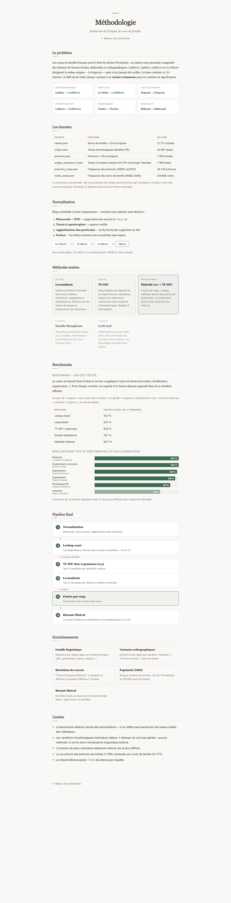

# Origine des noms de famille

Application web qui retourne l'etymologie et l'histoire d'un nom de famille ou d'un prenom francais.

La recherche utilise un pipeline hybride (Levenshtein + TF-IDF sur n-grammes de caracteres) pour retrouver l'entree correspondante dans une base de 21 777 noms, meme en cas de variante orthographique ou de faute de frappe. Le texte d'origine est ensuite resume par Mistral.

## Structure

```
app/          Application FastAPI + interface web
data/         Donnees JSON (noms, origines, prenoms, INSEE)
scripts/      Benchmarks et scripts de preparation des donnees
```

## Installation

```bash
pip install -r requirements.txt
```

Copier `.env.example` en `.env` et renseigner la cle API Mistral :

```bash
cp .env.example .env
```

## Lancement

```bash
uvicorn app.main:app --reload
```

L'application est accessible sur http://localhost:8000.

## Methodologie

La page `/methode` du site decrit le pipeline complet, les methodes testees et les resultats des benchmarks.


